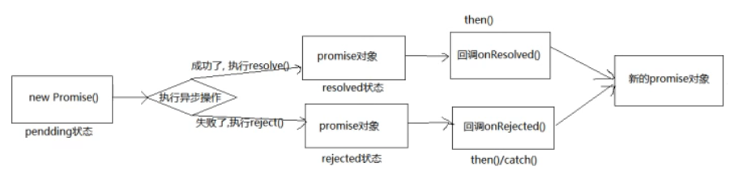

# Promise介绍
- ES6提出的异步编程的新的解决方案(旧方案是单纯使用回调函数)。
- 从语法上看：Promise是一个构造函数 (自己身上有all、reject、resolve这几个方法，原型上有then、catch等方法)
- 从功能上看：promise对象用来封装一个异步操作并可以获取其成功/失败的结果值。
- 支持链式调用，解决回调地狱问题。
- 指定回调的方式更为灵活。
---
# 异步编程
- fs 文件操作
  ```
  require('fs).readFile('/index.html', (err, data)=>{})
  ```
- 数据库操作
- AJAX
- 定时器
> 纯回调函数处理。
---
# Promise的状态改变 PromiseState
- pending 变为 resolved/fullfilled
- pending 变为 rejected
---
- promise 状态只能改变一次。
---
# PromiseResult
- 保存着异步任务返回的结果。
- resolve/reject 可以修改这里的值。
---
# Promise 工作流程

---
# Promise API

## Promise 构造函数
> Proise(excutor){}
- executor 函数：执行器函数`(resolve, reject) => {resolve}`
  ```js
  let p = new Promise(
      // 执行器函数
      // 立即同步调用
      (resolve, reject) => {
        // 异步操作在执行器中执行
      }
  )
  ```
- resolve 函数：内部定义成功时我们调用的函数
- reject 函数：内部定义失败时我们调用的函数
---
## Promise.prototype.then方法
- (onResolved, onRejected) => {}
- 返回一个新的 Promise 对象。
--

## Promise.prototype.catch方法
- 失败的回调。

## Promise.resolve() 方法
- (value) => {}
- 返回一个新的promise对象。
```js
let p = Promise.resolve(521);
console.log(p);
```
- 如果传入的参数为非Promise类型的对象，则返回的结果为成功promise对象。
- 如果传入的参数为 promise 对象，则返回的结果决定了 resolve 结果。
```js
let p = Promise.resolve(new Promise((resolve, reject) => {
  resolve("OK");
}))
```
---
## Promise.reject() 方法
- 属于Promise 函数对象，不属于实例对象。
- 返回一个失败的 promise 对象。
---
## Promise.all() 方法
- `(promises) => {}`
- promises: 包含n个promise的数组。
- 返回一个新的promise。
- 只有所有的Promise都成功才成功，只要有一个失败就直接失败。
```js
let p1 = new Promise((resolve, reject) => {
    resolve("Ok")
})
let p2 = Promise.resolve("yes");
let p3 = Promise.resolve("success");

const res = Promise.all([p1, p2, p3]);
console.log(res);
``` 
---
## Promise.race() 方法
- `(promises) => {}`
- 返回一个新的promise对象。
- 返回结果由第一个完成promise结果状态的决定。
---
# Promise 关键问题
## 如何改变promise状态
- resolve函数
- reject函数
- throw
```js
let p = new Promise((resolve, reject) => {
    // 1. resolve函数
    // pending -> resolved
    resolve('ok');

    // 2. reject函数
    // reject("error");

    // 3. 抛出错误
    // throw '出问题了';
})
```
---
## 能否执行多个回调 
> 一个promise指定多个成功/失败回调函数，都会调用吗？
当 `promise` 改变为对应状态时都会调用。
```js
let p = new Promise((resolve, reject) => {
    resolve("ok");
})
p.then(value => {
    console.log(value);
})
p.then(data => {
    console.log(data);
})
```
---
## 改变promise状态和指定回调函数谁先谁后？
```js
let p = new Promise((resolve, reject) => {
    // 当resolve是同步任务，先resolve,后then.
    // resolve("ok");

    // 当resolve改变状态是异步任务时，先then,后resolve
    setTimeout(() => {
        resolve("ok");
    }, 1000)
})
p.then(value => {
    console.log(value);
})
p.then(data => {
    console.log(data);
})
```
- 都有可能，正常情况下是先指定回调再改变状态，但也可以先改变装态，再指定回调。
- 如何先改变状态，再指定回调？
  - 在执行器中直接调用 resolve()/reject()
  - 延迟更长时间才能调用 then()
- 什么时候得到数据(回调函数什么时候执行）？
  - 如果先指定回调，那当状态发生改变时，回调函数就会调用，得到数据。
  - 如果先改变状态，当指定回调时，回调函数就会调用，得到数据。
---

## promise.then()
```js
let p = new Promise((resolve, reject) => {
    resolve("ok");
})
let res = p.then(value => {
    console.log(value);
})
console.log(res);
/* 
Promise
    [[Prototype]]: Promise
    [[PromiseState]]: "fulfilled"
    [[PromiseResult]]: undefined
*/
```
- 返回的promise的结果状态由 then() 指定的回调函数执行的结果决定。
- 三种情况：
  - 抛出错误。
  - 返回一个非promsie对象，resolve；结果就是return的结果。
  - 返回一个promise 对象，return 的promsie决定了then 返回的promise的状态。
    ```js
    let p = new Promise((resolve, reject) => {
        resolve("ok");
    })
    let res = p.then(value => {
        
        return new Promise((resolve, reject) => {
            reject('error')
        })
    })
    console.log(res);
    ```
---
## promise如何串联多个操作任务？
```js
let p = new Promise((resolve, reject) => {
  resolve("ok")
})
p.then(value => {
  return value;
}).then(value => {
  console.log(value); // ok
}).then(value => {
  console.log(value); // undefined
})
```
- promise 的 then() 返回一个新的 promise，可以并成 then() 的链式调用
- 通过then的调用串联多个异步/同步任务。
---
## promise异常穿透
```js
let p = new Promise((resolve, reject) => {
  // resolve("ok")
  reject("errrr!")
})
p.then(value => {
  return value;
}).then(value => {
  console.log(value); /
  return value
}).then(value => {
  console.log(value); 
}).catch(err => {
  console.log(err);
})
```
- 当使用 promise 的 then 链式调用时，可以在最后指定失败的回调。
- 前面任何操作出了异常，都会传到最后失败的回调中处理。
---
## 中断promise链条
```js
let p = new Promise((resolve, reject) => {
    resolve("ok");
})
p.then(value => {
    return value;
}).then(value => {
    console.log(value);
    // 返回一个pending状态的promise
    return new Promise(() => {}); 
}).then(value => {
    console.log(value); 
}).catch(err => {
    console.log(err);
})
```
- 当使用 promise 的 then 链式调用时，在中间中断，不再调用后面的回调函数。
- 办法：在回调函数中返回一个 pending 状态的 promise 对象。
---
# 手撕 Promise

# async await

## async
- 函数的返回值为promise对象
- promise对象的返回结果由 async 函数执行的返回值决定.
## await
- await右侧的表达式一般为promsie对象,但也可以是其它值.
- 如果表达式是promise对象,await返回的是promise成功的值
- 如果表达式是其它值,直接将此值作为await返回值.
- await 必须写在 async 函数中.
- await 的 promise 失败了,救护抛出异常.


# 笔记参考
[CSDN链接](https://blog.csdn.net/weixin_44972008/article/details/113779708)